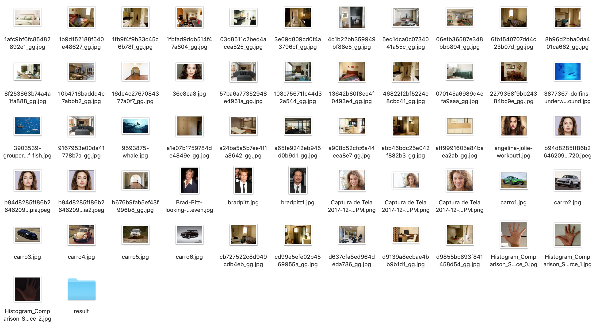
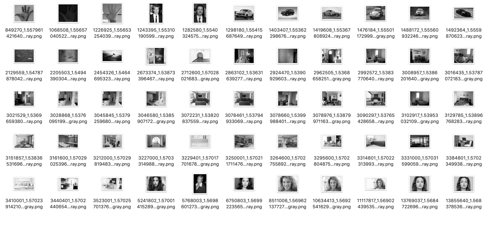

# javacv_pocs

In this project i implemented a strategy of image separation based on its content without necessarily having to use other images for it. The strategy consists of establishing a relationship between the number of lines in the image and the number of simple shapes such as squares and circles.
This relationship will generate a ranking that will be used to name the images and thus allows orderly visualization in the file system.

 

A set of sample images is available for testing in the resource folder.
 
Running the program generates new ordered images in the resources / result folder.  

Below 2 photos show a set of images of people, cars, rooms and fish. After using the algorithm to process the images, the groups became more visible.
<h3>Image set before process</h3>

<h3>Image set after process</h3>

